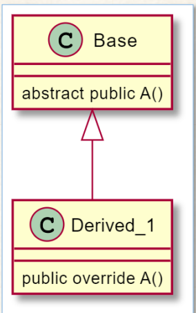

# Lab 12 Exercise 1

## Abstract member

1.สร้าง console application project

```cmd
dotnet new console --name Lab12_Ex01
```

2.เปลี่ยน code ให้เป็นดังต่อไปนี้

```cs
BaseClass BC = new DerivedClass();
BC.A(); 

abstract class BaseClass
{
    abstract public void A();
}
class DerivedClass : BaseClass
{
    public override void A()
    {
        System.Console.WriteLine("Implementation of inheritance classes");
    }
}
```

3.Build project โดยการใช้คำสั่ง

```cmd
dotnet build  Lab12_Ex01
```

ถ้ามีที่ผิดพลาดในโปรแกรม ให้แก้ไขให้ถูกต้อง

4.บันทึกผลที่ได้จากการรันคำสั่งในข้อ 3


5.Run project โดยการใช้คำสั่ง

```cmd
dotnet run --project Lab12_Ex01
```

6.บันทึกผลที่ได้จากการรันคำสั่งในข้อ 5


7.อธิบายสิ่งที่พบในการทดลอง
- BaseClass เป็น abstract class ที่ประกาศ abstract member ชื่อ A() ซึ่งไม่ได้มีการกำหนดการปฏิบัติสำหรับเมทอด A() ในตัวเอง แต่เป็น abstract method ซึ่งถูกประกาศและต้องการการสร้างตัวอักษรให้กับคลาสที่สืบทอดมา
- DerivedClass เราทำการสร้างการปฏิบัติสำหรับเมทอด A() ตามที่กำหนดใน BaseClass ด้วย override ซึ่งแสดงการโอเวอร์ไรด์เมทอด abstract จาก BaseClass
