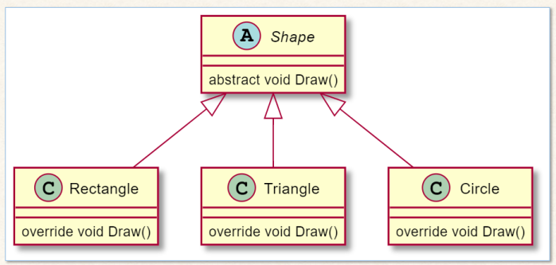

# Lab 12 Exercise 2

## Abstract class



1.สร้าง console application project

```cmd
dotnet new console --name Lab12_Ex02
```


2.เปลี่ยน code ให้เป็นดังต่อไปนี้

```cs
Shape[] shapes = new Shape[3];
shapes[0] = new Rectangle();
shapes[1] = new Triangle();
shapes[2] = new Circle();

foreach (var shape in shapes)
{
    shape.Draw();
}

abstract class Shape
{
    public abstract void Draw();
}
class Rectangle: Shape
{
    public override void Draw()
    {
        System.Console.WriteLine("Draw a rectangle");
    }
}
class Triangle: Shape
{
    public override void Draw()
    {
        System.Console.WriteLine("Draw a triangle");
    }
}
class Circle: Shape
{
    public override void Draw()
    {
        System.Console.WriteLine("Draw a circle");
    }
}
```


3.Build project โดยการใช้คำสั่ง

```cmd
dotnet build  Lab12_Ex02
```

ถ้ามีที่ผิดพลาดในโปรแกรม ให้แก้ไขให้ถูกต้อง

4.บันทึกผลที่ได้จากการรันคำสั่งในข้อ 3


5.Run project โดยการใช้คำสั่ง

```cmd
dotnet run --project Lab12_Ex02
```

6.บันทึกผลที่ได้จากการรันคำสั่งในข้อ 5


7.อธิบายสิ่งที่พบในการทดลอง

จากการทดลองนี้เรามีการสร้างและใช้งานคลาสและอ็อบเจกต์โดยมีโครงสร้างดังนี้
คลาส Shape เป็น abstract class ที่มีเมทอด abstract Draw() ซึ่งไม่มีการนิยามเนื้อหา ซึ่งเป็นแนวทางที่จะให้คลาสลูกๆ โอเวอร์ไรด์เมทอดนี้ตามลำดับการทำงานของแต่ละรูปร่าง
คลาส Rectangle, Triangle, Circle: คลาสลูกทั้งสามนี้ได้โอเวอร์ไรด์เมทอด Draw() เพื่อนำเสนอข้อความที่บอกถึงการวาดรูปร่างแต่ละแบบ
การสร้างอ็อบเจกต์และการเรียกใช้งาน ใน Main method เราสร้างอาร์เรย์ของอ็อบเจกต์ Shape และกำหนดค่าให้แต่ละอินสแตนซ์เป็นอ็อบเจกต์ของคลาสลูก (Rectangle, Triangle, Circle) ตามลำดับ จากนั้นเราใช้ลูป foreach เพื่อวนลูปผ่านทุกๆ อ็อบเจกต์ในอาร์เรย์ shapes และเรียกเมทอด Draw() ของแต่ละอ็อบเจกต์ ซึ่งจะแสดงผลลัพธ์ที่เกี่ยวข้องกับรูปร่างแต่ละแบบที่ถูกสร้างขึ้น เช่น "Draw a rectangle", "Draw a triangle", "Draw a circle" ตามลำดับของอาร์เรย์

ผลลัพธ์ของการทำงานจะแสดงข้อความที่บอกถึงการวาดรูปร่างของแต่ละคลาสที่ถูกสร้างขึ้น ซึ่งจะได้เป็น "Draw a rectangle", "Draw a triangle", "Draw a circle" ตามลำดับที่กำหนดไว้ใน Main method
